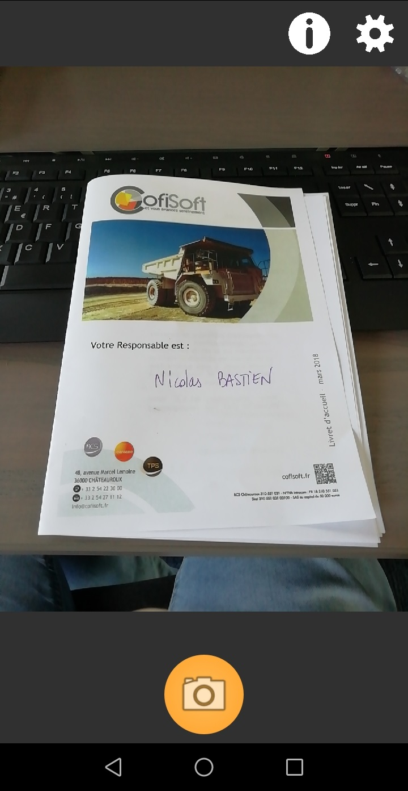
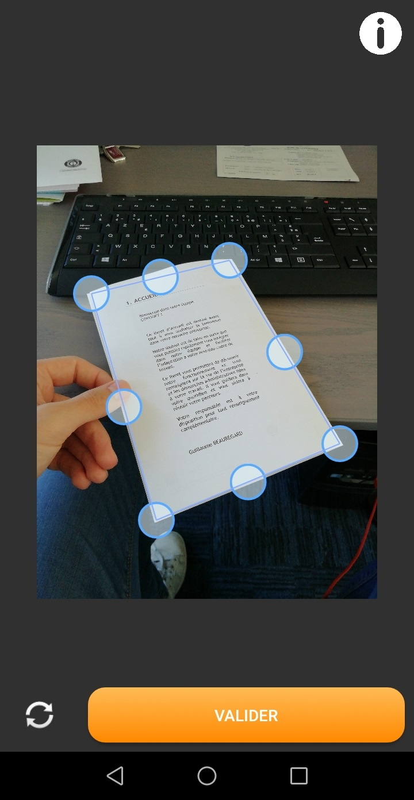
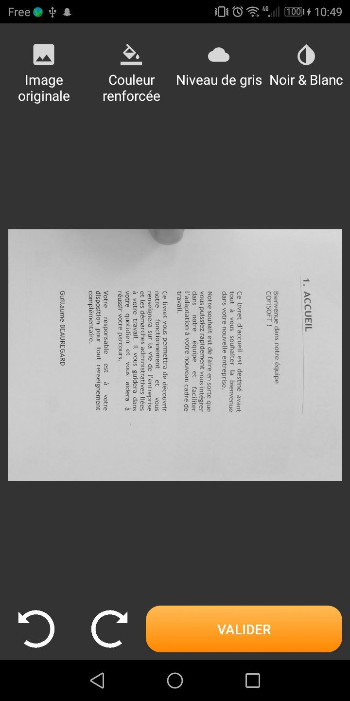

# Document scanner
Automatically detect a document on a photo then scan it

Open the OpenScan_test folder with Android Studio to edit the project

The library monscanner use OpenCV. You can update OpenCV with the last release version to upgrade the performances.

Available in french/english

# Screenshots
        

# Sources
I used lot of code from <a href="https://github.com/jhansireddy/AndroidScannerDemo">jhansireddy/AndroidScannerDemo</a>
